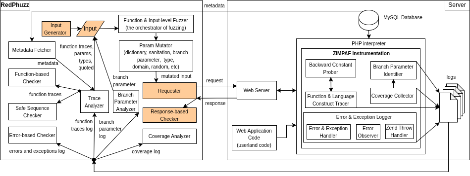

# ZIMPAF_RedPhuzz

**ZIMPAF_RedPhuzz** is a high-fidelity grey-box fuzzing framework for PHP web applications.

## Research Context

ZIMPAF_RedPhuzz is developed as part of ongoing security research at Computer Science and Engineering Department, College of Engineering, The University of Texas at Arlington.
It combines Zend VM–level instrumentation with feedback mechanism to provide deep runtime visibility and highly-targeted vulnerability detection.

---
## Architecture



## What is ZIMPAF?

**ZIMPAF** stands for:

> **Zend Instrumentation Module for PHP Application Fuzzing**

It is an interpreter instrumentation engine to achieve a high-fidelity web application fuzzing via
branch, error and exception, language construct and function call monitoring. See ZIMPAF's README for details.

## What is RedPhuzz?

**RedPhuzz** is a redesigned fuzzer based on:

Phuzz — Neef, Sebastian, Lorenz Kleissner, and Jean-Pierre Seifert.
*"What all the phuzz is about: A coverage-guided fuzzer for finding vulnerabilities in PHP web applications."*
Proceedings of the 19th ACM Asia Conference on Computer and Communications Security, 2024.

Original Phuzz repository:
https://github.com/gehaxelt/phuzz/tree/main/code/fuzzer

The four brown-shaded components in RedPhuzz are reused from Phuzz.


---

# 🚀 Getting Started
We suggest to run our framework directly on host computer due to massive and deep-surgical monitoring of branches, language constructs, and function calls. E.g., for  Wordpress plugin Arprice-responsive-pricing-table-3.6, it logs 35,623 language constructs and function calls, and 81,730 branch instruction executions, producing > 43MB log. While the instrumentation itself is highly efficient, running inside Docker may introduce performance degradation due to additional environment layers, which can particularly affect I/O operations. The framework has been tested on a computer with the following specs: Intel® CoreTM i7-8550U CPU @ 1.80 GHz (4 cores), 16 GB of RAM, and NVMe SSD 2 TB. The benchmarks are hosted on Ubuntu with Apache/2.4.58 mod_php and PHP 8.3.19.

## 1. Start the Environment
Go to project root: zimpaf_redphuzz and open terminal in this folder and execute

Run:

```bash
docker compose up
```

---

## 2. Running the Fuzzer

### Batch Run — Multiprocessing (Recommended)

- Runs all 86 test cases.
- You can modify the number of processes created:
  - Open `redphuzz/fuzzer_redphuzz_batch_mp.py`
  - Scroll to the bottom (around line 2549)
  - Please make sure the number of processes is balanced with the number of apache workers specified in ```zimpaf_redphuzz/zimpaf_mpm_prefork.conf```.

Run:

```bash
docker exec -it zimpaf_redphuzz python3 fuzzer_redphuzz_batch_mp.py
```

---

### Batch Run — Single Process

- Runs most test cases (excluding heavy/large WordPress plugins).

Run:

```bash
docker exec -it zimpaf_redphuzz python3 fuzzer_redphuzz_batch_sp.py
```

---

### Single Test Case Run

- Open `redphuzz/fuzzer_redphuzz.py` on host. Since the folder is mapped using a bind volume, any changes will be reflected in the corresponding files inside the ```zimpaf_redphuzz``` container.
- Scroll to the bottom
- Uncomment the test case you want to fuzz

Run:

```bash
docker exec -it zimpaf_redphuzz python3 fuzzer_redphuzz.py
```

---

## Output

All detected vulnerabilities are stored on the host:

```
redphuzz/output/fuzzer[id]
```

---

## Instrumentation Logs (Inside Container)

```
/shared-tmpfs/coverage-reports
/shared-tmpfs/error-reports
/shared-tmpfs/exception-reports
/shared-tmpfs/function-call-traces
/shared-tmpfs/input_params_comparisons
/shared-tmpfs/mysql-error-reports
/shared-tmpfs/shell-error-reports
```

### Log Descriptions

- **coverage-reports** — Coverage data collected from Zend VM
- **error-reports** — Generated by `zend_error_cb` and error observer
- **exception-reports** — Generated by `zend_throw_hook` and `ZEND_THROW` handler
- **function-call-traces** — Traces of vulnerable and sanitization functions
- **input_params_comparisons** — Branch instructions influenced by input
- **mysql-error-reports** — MySQL error traces via mysqlnd and PDO
- **shell-error-reports** — Command injection error traces via command injection functions handler, some of which require simulation.

Although these directories contain the name `tmpfs`, they are NOT memory-backed.
The system runs on a 16GB RAM machine, and storing large logs/traces purely in memory is inefficient.
If you have larger memory, it is better to use memory. However, please consider that 1 request submission
for big wordpress plugin can produce >30MB logs.

---

## Input Directory

```
/sync-tmpfs/
```

If you want a clean fuzzing start, delete the content of this directory first.
Otherwise, incomplete inputs are restored automatically.

---

## Restarting the Container
If for a reason you stop the containers and want to restart it again using this command:

```bash
docker start zimpaf_redphuzz
```
wait for about 1-2 minutes until the apache2 on docker is ready to serve requests.

---


## ⚡ Performance Optimization: UFS vs. Host Execution

While this framework is fully containerized for reproducibility, the **Docker Union File System (UFS)** can introduce significant I/O latency. High-frequency file writes generated in the `/shared-tmpfs/` directory can trigger I/O bottlenecks.

**For this reason, we highly suggest running the framework on the host directly for maximum throughput.** For large targets (e.g., complex **WordPress plugins**), ZIMPAF can generate bursts exceeding **30 MB per write**. While the framework utilizes **large-scale batch writing** to minimize syscall overhead, the Docker storage driver (Overlay2) can struggle with these heavy bursts on standard hardware.

### **Optimizing I/O Throughput**
If you are **still opting for a Docker run** and experience performance degradation or high Disk Wait (I/O Wait) on a host with limited resources (e.g., **16 GB RAM / SATA SSD**), which was the evaluation environment for this framework, we suggest:

1. **Volume Binding:** The default `docker-compose.yml` only maps `redphuzz/output` to the host, keeping other files isolated. To mitigate UFS overhead, you can extend volume binding to the `/shared-tmpfs/` and `/sync-tmpfs/` directories in your Compose file.
2. **Native Execution:** For maximum throughput and detection accuracy, we recommend running the framework directly on the **host machine**.
    * Ensure the host has `php-dev` headers and `build-essential` installed.
    * Compile ZIMPAF locally: `phpize && ./configure && make`.
    * This eliminates the Docker storage abstraction layer, providing direct NVMe/SSD access for the mutation engine.

> **Note on Memory:** Although the logging directories are named `tmpfs`, they are currently mapped to physical storage to prevent **Out-Of-Memory (OOM)** errors on 16 GB systems.

### 🧹 Disk Space & Log Management

Currently, the framework retains all instrumentation logs in the container's `/shared-tmpfs/` to allow for deep post-mortem analysis of every mutation. However, due to the high-volume nature of ZIMPAF traces (can reach 30 MB+ per burst):
* **Manual Cleanup:** Users are advised to periodically clear the `/shared-tmpfs/` subdirectories between major benchmark runs to prevent disk saturation or you can add a function to remove them from RedPhuzz. You can also clean up the output in `/redphuzz/output`.
* **Planned Feature:** Future version of **the front-end fuzzer** will include this feature.

## Reporting Bugs

If you discover a bug or security issue, please open an issue on GitHub.
For responsible disclosure of security vulnerabilities, you may contact:

Tennov Simanjuntak
<tennov.simanjuntak@uta.edu>

---

## License

Copyright (c) 2026 Tennov Simanjuntak

All rights reserved.

